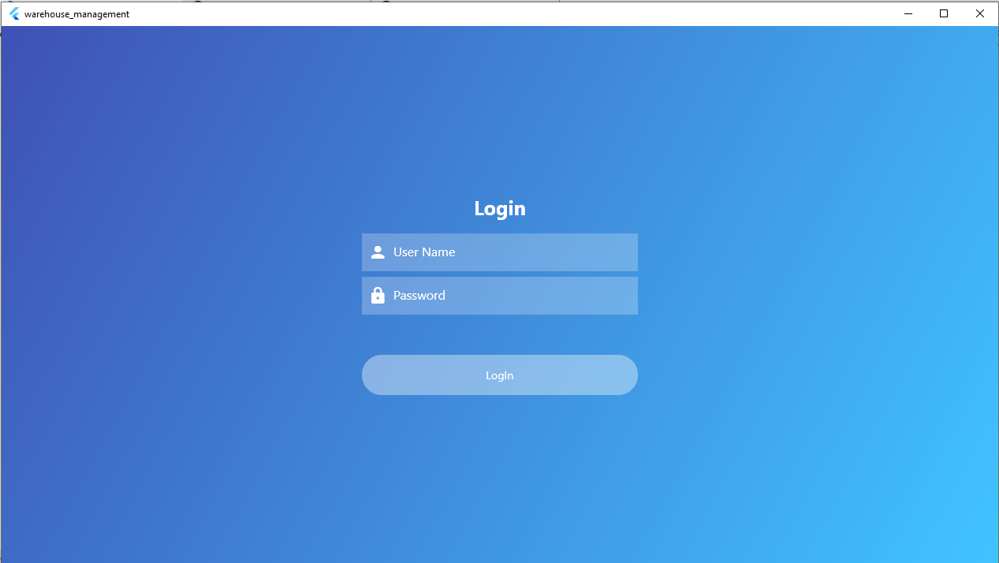
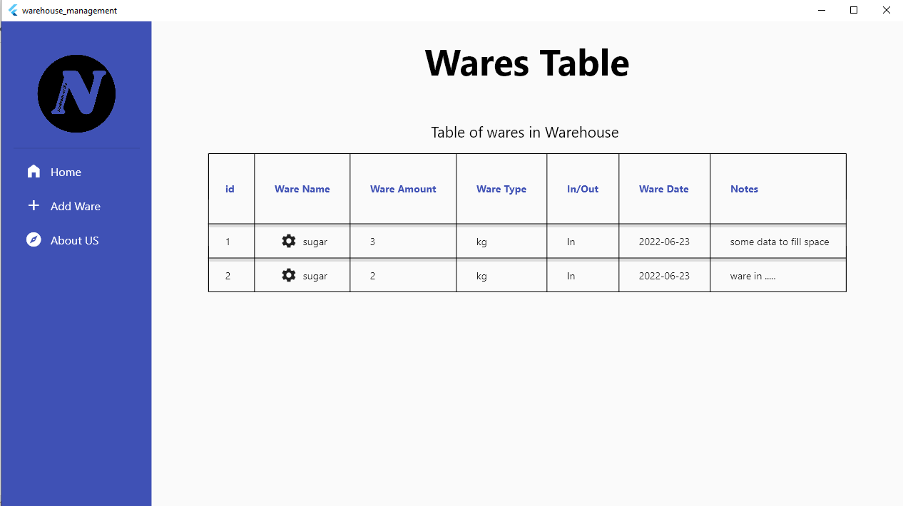
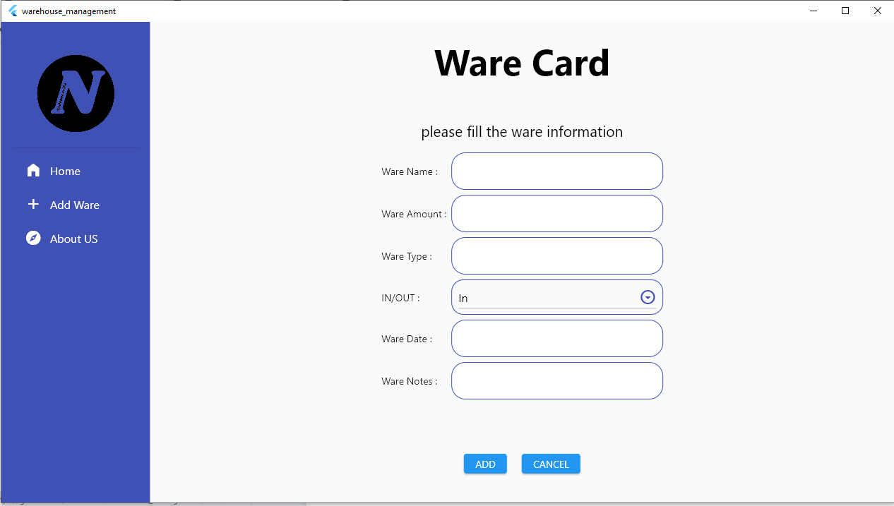
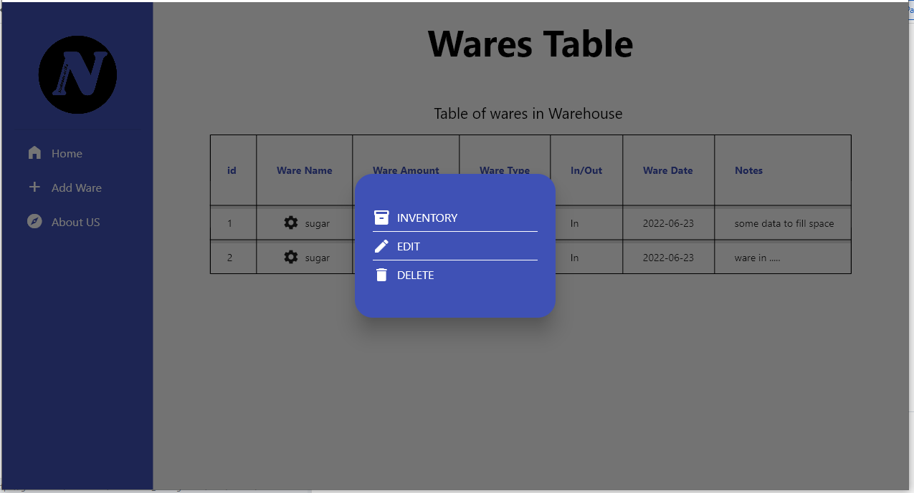
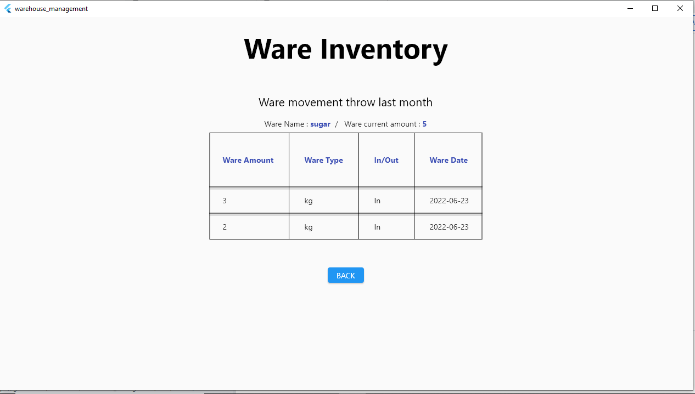

# warehouse_management

A new Flutter project for windows.

  

 

## features

* This project is a windows app that u can manage material in warehouse.

* Bloc .

* You can add wares with varius of information about it.

* You can edit and delete any wares.

* You can get inventory for any of the ware in the warehouse such as current amount and ware movevement throw month(in/out).

* Sqlflite with sqflite_common_ffi for storing data locally.

## To see other projects developed by me :

- [Portfolio](https://nadeemze.github.io/Portfolio/)
